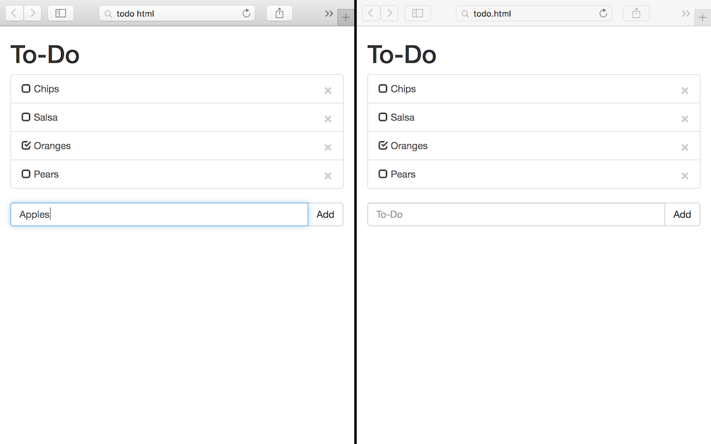
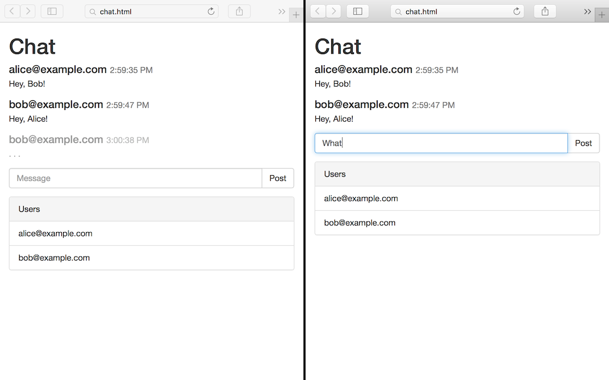

# SwimJS

`swimjs` is a JavaScript runtime for the [Swim](https://github.com/swimit/swim)
platform.  Swim makes it easy to build realtime applications that transcend
client and server.  Create cloud services that mirror client features, and
drop-in view controllers that automatically synchronize with the cloud.
If you can register an event handler, you can architect a realtime app with
Swim.  

If you'd like a better understanding of how Swim works, you can find out more
by reading the [Swim overview](https://github.com/swimit/swim).

## Installation

### Mac

`swimjs` for Mac installs using [Homebrew](http://brew.sh/).

```sh
brew tap swimit/swim
brew install swimjs
```

If you've previously installed `swimjs`, make sure to update to the latest release:

```sh
brew update
brew upgrade swimjs
```

### Linux

`swimjs` is available as a `deb` package for Linux systems. Swim requires
Java8, please ensure that Java 8 is your default java version.

```sh
gpg --keyserver pgpkeys.mit.edu --recv-key 7015E74D1C9EB5D6
gpg -a --export 7015E74D1C9EB5D6 | sudo apt-key add -
echo "deb https://repo.swim.it/swim-deb swim main" | sudo tee -a /etc/apt/sources.list
sudo apt-get update
sudo apt-get install swimjs
```

### Windows

Download [swimjs for Windows](https://repo.swim.it/swim-universal/swimjs-0.1.0-alpha3.zip).
Uncompress the zip file into an appropriate directory. Add the file called
swimjs.bat under the swimjs/bin directory to your Windows PATH variable. Swim
requires Java8 which can be
[downloaded from Oracle](http://www.oracle.com/technetwork/java/javase/downloads/jdk8-downloads-2133151.html).

## Getting Started

The easiest way to understand Swim is to start building an app.  Check out
the [SwimJS API docs](API.md), and the
[Swim JavaScript client docs](https://github.com/swimit/swim-client-js), for
descriptions on the APIs used in these examples.

### To-Do App

Let's build a basic To-Do list app with real-time synchronization between
users.  First we'll build the server side of the app.  Create a file named
`todo.js` and paste in the code below.  We'll tall about what this code does
in a minute.

```js
var service = require('swim-service-js');
var todo = new service.ListLane().register('todo/list');
if (todo.isEmpty()) {
  todo.push({item: 'Chips'});
  todo.push({item: 'Salsa'});
}
```

Next we'll build the UI.  Paste the HTML below into a file called `todo.html`.
Put the file in the same directory as `todo.js`.  We'll explain the Swim parts
shortly; most of this is standard [AngularJS](https://angularjs.org)
boilerplate.

```html
<!DOCTYPE html>
<html ng-app="todo">
  <head>
    <meta charset="UTF-8">
    <title>To-Do</title>
    <link href="https://maxcdn.bootstrapcdn.com/bootstrap/3.3.6/css/bootstrap.min.css" rel="stylesheet"/>
  </head>
  <body ng-controller="TodoList" class="container">
    <h1>To-Do</h1>
    <div class="list-group">
      <a ng-repeat="item in items.state" ng-click="toggle($index)" class="list-group-item">
        <span ng-if="!item.checked" class="glyphicon glyphicon-unchecked"></span>
        <span ng-if="item.checked" class="glyphicon glyphicon-check"></span>
        {{item.item}}
        <button ng-click="remove($index)" type="button" class="close">&times;</button>
      </a>
    </div>
    <form ng-submit="add()" class="input-group">
      <input type="text" ng-model="newItem" placeholder="To-Do" class="form-control"/>
      <span class="input-group-btn">
        <input type="submit" value="Add" class="btn btn-default"/>
      </span>
    </form>
    <script src="https://ajax.googleapis.com/ajax/libs/angularjs/1.5.0/angular.min.js"></script>
    <script src="https://repo.swim.it/swim/recon-0.3.9.js"></script>
    <script src="https://repo.swim.it/swim/swim-client-0.4.5.js"></script>
    <script>
      var app = angular.module('todo', []);
      app.controller('TodoList', function ($scope) {
        $scope.items = swim.downlink()
          .node('ws://localhost:5619/todo/grocery')
          .lane('todo/list')
          .onEvent(function (message) {
            $scope.$apply(); // Update the view.
          })
          .syncList();
        $scope.add = function () {
          $scope.items.push({item: $scope.newItem});
          $scope.newItem = '';
        };
        $scope.toggle = function (index) {
          var item = $scope.items.get(index);
          item.checked = !item.checked;
          $scope.items.set(index, item)
        }
        $scope.update = function (index) {
          $scope.items.set(index);
        };
        $scope.remove = function (index) {
          $scope.items.splice(index, 1);
        };
      });
    </script>
  </body>
</html>
```

We're almost ready to run the app.  The last thing we need to do is add a
file called `swim.recon` with our server configuration.  We'll get into the
details after we get the app up and running.  Create a `swim.recon` file in
the same directory as `todo.js`, and paste in the following:

```recon
@server {
  port: 5619
  store: "todo.store"
  @route {
    prefix: "/todo/"
    service: "todo"
  }
}
@service {
  name: "todo"
  main: "todo.js"
}
```

Let's fire it up.  Open a terminal and navigate to the directory with the
files you just created.  Start the SwimJS server by running `swimjs` on the
command line.  Then open `todo.html` in multiple browser windows.



Let's explore what we did. 

We started a `swimjs` server that gets its instructions from the
[`swim.recon`](API.md#swimrecon-file) file in the current directory.  The
`swim.recon` file says that the server should listen for connections on port
`5619`, and store data in a file called `todo.store`.  It also defines a
`@route`, which states that URI paths that begin with `/todo/` should map to a
service class named `todo`.

```recon
@server {
  port: 5619
  store: "todo.store"
  @route {
    prefix: "/todo/"
    service: "todo"
  }
}
```

The `swim.recon` file then goes on to declare the `@service` named `todo`,
specifying that the `todo` service is defined in a file called `todo.js`.

```recon
@service {
  name: "todo"
  main: "todo.js"
}
```

The net result is that every URI path on our Swim server that starts with
`/todo/` refers to a unique instance of our `todo.js` service.

In the `todo.js` service, we created a `ListLane` and named it `todo/list`.
A `ListLane` stores a sequence of values, and publishes change events to
linked clients.

```js
var todo = new service.ListLane().register('todo/list');
```

On the client, we synchronized the `todo/list` lane of `/todo/grocery`
service, and populated the UI with the items in the list.  Swim synchronizes
data by creating downlinks.  A downlink is a subscription to the events
published by a lane.  Whenever the list changes on the server, the downlink
updates the client.  In Swim terminology, a `node` is the URI of a particular
Swim service instance.

```js
$scope.items = swim.downlink()
  .node('ws://localhost:5619/todo/grocery')
  .lane('todo/list')
  .onEvent(function (message) {
    $scope.$apply(); // Update the view.
  })
  .syncList();
```

We also defined an `add` function that appends a new item to the list.  Adding
an item to a downlink automatically pushes the change to the linked Swim
 service.

```js
$scope.add = function () {
  $scope.items.push({item: $scope.newItem});
  $scope.newItem = '';
};
```

If you open multiple browser windows, you'll see that when you change the list
in one window, the other windows update instantaneously.

### Chat App

How about we build a chat app next?  Create a new directory and add a
`chat.js` file with the server-side code below:

```js
var service = require('swim-service-js');

var room = new service.TailLane(function (message) {
  // Delete chat messages after 1 minute.
  return Date.now() - (message.time || 0) > 60 * 1000;
}).register('chat/room');
room.onCommand = function (message, uplink) {
  // Insert time into posted chat messages.
  var chatMessage = {
    time: Date.now(),
    text: message.body.text
  };
  console.log(new Date(chatMessage.time) + ': ' + chatMessage.text);
  room.push(chatMessage);
};

setInterval(function () {
  // Check in on the chatroom every 30 seconds.
  if (room.isEmpty()) {
    console.log('Where did everybody go?');
    room.push({
      time: Date.now(),
      text: 'Is anybody here?'
    });
  }
}, 30 * 1000);
```

Then create `chat.html` and fill it with the following simple chat UI:

```html
<!DOCTYPE html>
<html ng-app="chat">
  <head>
    <meta charset="UTF-8">
    <title>Chat</title>
    <link href="https://maxcdn.bootstrapcdn.com/bootstrap/3.3.6/css/bootstrap.min.css" rel="stylesheet"/>
  </head>
  <body ng-controller="ChatRoom" class="container">
    <h1>Chat</h1>
    <div style="margin-bottom: 1em;">
      <div ng-repeat="message in messages.state" class="media">
        <h4 class="media-heading"><small>{{message.time | date:'h:mm:ss a'}}</small></h4>
        <p class="media-body">{{message.text}}</p>
      </div>
    </div>
    <form ng-submit="post()" class="input-group">
      <input type="text" ng-model="newMessage" placeholder="Message" class="form-control"/>
      <span class="input-group-btn">
        <input type="submit" value="Post" class="btn btn-default"/>
      </span>
    </form>
    <script src="https://ajax.googleapis.com/ajax/libs/angularjs/1.5.0/angular.min.js"></script>
    <script src="https://repo.swim.it/swim/recon-0.3.9.js"></script>
    <script src="https://repo.swim.it/swim/swim-client-0.4.5.js"></script>
    <script>
      var app = angular.module('chat', []);
      app.controller('ChatRoom', function ($scope) {
        $scope.messages = swim.downlink()
          .node('ws://localhost:5619/chat/public')
          .lane('chat/room')
          .onEvent(function (message) {
            $scope.$apply(); // Update the view.
          })
          .syncList();
        $scope.post = function () {
          $scope.messages.command({text: $scope.newMessage});
          $scope.newMessage = '';
        };
      });
    </script>
  </body>
</html>
```

Next create a Swim server configuration for the chat app in a new `swim.recon`
file:

```recon
@server {
  port: 5619
  store: "chat.store"

  @route {
    prefix: "/chat/"
    service: "chat"
  }
}

@service {
  name: "chat"
  main: "chat.js"
}
```

Open a terminal, navigate to the directory with the files you just created,
and run `swimjs`.  Open `chat.html` in multiple browser windows, and start
chatting.

Let's go over what's new in the chat example, starting with the server side.
The lane we used for our chat room is called a `TailLane`.  Like a `ListLane`,
a `TailLane` stores a sequence of items, and publishes change events.  But a
`TailLane` uses a `dropWhile` function, passed to the lane's constructor, to
decide when to drop old messages.  In the case of our `chat/room` lane, we
drop messages after 1 minute.

```js
var room = new service.TailLane(function (message) {
  // Delete chat messages after 1 minute.
  return Date.now() - (message.time || 0) > 60 * 1000;
}).register('chat/room');
```

Next, we attach an `onCommand` callback to the `chat/room` lane.  A Swim
_command_ is like a method call on a lane.  We use commands on the `chat/room`
lane to post new messages to the chat room.  We make sure to insert the
current time into the message so that the lane's `dropWhile` function can
determine how old the message is.

```js
room.onCommand = function (message, uplink) {
  // Insert time into posted chat messages.
  var chatMessage = {
    time: Date.now(),
    text: message.body.text
  };
  console.log(new Date(chatMessage.time) + ': ' + chatMessage.text);
  room.push(chatMessage);
};
```

Lastly, we set a timer that fires every 30 seconds and posts a message to the
chat room, if there's no other activity.

```js
setInterval(function () {
  // Check in on the chatroom every 30 seconds.
  if (room.isEmpty()) {
    console.log('Where did everybody go?');
    room.push({
      time: Date.now(),
      text: 'Is anybody here?'
    });
  }
}, 30 * 1000);
```   

### Chat with Presence

Chat isn't very useful if you don't know who's chatting.  Thankfully, Swim
makes it easy to track user presence.  To see how, create a new directory
called `chat-presence` to hold the files for our updated chat app.

In `chat-presence/chat.js`, paste in the following service code:

```js
var service = require('swim-service-js');
var recon = require('recon-js');

var chatInfo = new service.ValueLane().register('chat/info');

var chatUsers = new service.MapLane().register('chat/users');
chatUsers.clear(); // clear on startup

var chatRoom = new service.TailLane(function (message) {
  // Delete chat messages after 15 minutes.
  return Date.now() - (message.time || 0) > 15 * 60 * 1000;
}).register('chat/room');

chatRoom.onCommand = function (message, uplink) {
  if (!uplink.user.email) return;
  console.log(uplink.user.email + ' posted ' + message.body.text);
  chatRoom.push({
    from: uplink.user.email, // insert user credentials
    name: uplink.user.name,
    time: Date.now(),
    text: message.body.text
  });
};

// Called when a user first links to the lane
chatRoom.onEnter = function (user) {
  if (!user.email) return;
  // Add user to chat/users lane
  console.log(user.email + ' entered ' + service.nodeUri);
  chatUsers.set(user.email, {email: user.email, name: user.name});

  // Update userCount in chat/info lane
  var info = chatInfo.get() || {};
  info.userCount = chatUsers.size;
  chatInfo.set(info);
};

// Called when a user last unlinks from the lane
chatRoom.onLeave = function (user) {
  if (!user.email || !chatUsers.has(user.email)) return;
  // Remove user from chat/users lane
  console.log(user.email + ' left ' + service.nodeUri);
  chatUsers.delete(user.email);

  // Update userCount in chat/info lane
  var info = chatInfo.get() || {};
  info.userCount = chatUsers.size;
  chatInfo.set(info);
};

var chatInput = new service.CommandLane().register('chat/input');
chatInput.onCommand = function (message, info) {
  if (!info.user.email) return;
  var chatUser = chatUsers.get(info.user.email);
  if (!chatUser) return;
  var typing = message.body['@typing'] // get value of recon @typing attribute
  if (typing !== undefined && typing !== 'false') {
    // Add typing properties when user starts typing
    chatUser.typing = true;
    chatUser.typingTime = Date.now();
    console.log(info.user.email + ' started typing');
  } else {
    // Remove typing properties when user stops typing
    recon.remove(chatUser, 'typing');
    recon.remove(chatUser, 'typingTime');
    console.log(info.user.email + ' stopped typing');
  }
  // Update user to reflect new typing state
  chatUsers.set(info.user.email, chatUser);
};
```

Add the UI code below to `chat-presence/chat.html`:

```html
<!DOCTYPE html>
<html ng-app="chat">
  <head>
    <meta charset="UTF-8">
    <title>Chat</title>
    <link href="https://maxcdn.bootstrapcdn.com/bootstrap/3.3.6/css/bootstrap.min.css" rel="stylesheet"/>
  </head>
  <body ng-controller="ChatRoom" class="container">
    <h1>Chat</h1>
    <form ng-if="!signedIn" ng-submit="signIn()" class="form-inline">
      <!-- Sign-In form -->
      <input type="email" ng-model="$parent.emailInput" class="form-control" placeholder="Email"/>
      <input type="text" ng-model="$parent.nameInput" class="form-control" placeholder="Name"/>
      <button type="submit" class="btn btn-default">Sign-In</button>
    </form>
    <div ng-if="signedIn" class="row">
      <div class="col-md-8" style="margin-bottom: 1em;">
        <div style="margin-bottom: 1em;">
          <div ng-repeat="message in messages.state" class="media">
            <!-- Chat message -->
            <h4 class="media-heading">{{message.from}} <small>{{message.time | date:'h:mm:ss a'}}</small></h4>
            <p class="media-body">{{message.text}}</p>
          </div>
          <div ng-repeat="user in users.state" ng-if="user.typing &amp;&amp; user.email !== emailInput" class="media" style="opacity: 0.5;">
            <!-- User is typing -->
            <h4 class="media-heading">{{user.email}} <small>{{user.typingTime | date:'h:mm:ss a'}}</small></h4>
            <p class="media-body"> . . .</p>
          </div>
        </div>
        <form ng-submit="post()" class="input-group">
          <!-- Chat input form -->
          <input type="text" ng-model="$parent.chatInput" ng-change="chatInputChanged()" placeholder="Message" class="form-control"/>
          <span class="input-group-btn">
            <input type="submit" value="Post" class="btn btn-default"/>
          </span>
        </form>
      </div>
      <div class ="col-md-4">
        <div class="panel panel-default">
          <!-- User list -->
          <div class="panel-heading">Users</div>
          <ul class="list-group">
            <li ng-repeat="user in users.state" class="list-group-item">{{user.email}}</li>
          </ul>
        </div>
      </div>
    </div>
    <script src="https://ajax.googleapis.com/ajax/libs/angularjs/1.5.0/angular.min.js"></script>
    <script src="https://repo.swim.it/swim/recon-0.3.9.js"></script>
    <script src="https://repo.swim.it/swim/swim-client-0.4.5.js"></script>
    <script>
      var app = angular.module('chat', []);
      app.controller('ChatRoom', function ($scope) {
        // Use swim scopes to simplify downlink management
        var host = swim.host('ws://localhost:5619');
        var chat;

        // Prefill sign-in fields from local storage
        $scope.emailInput = localStorage.getItem('email');
        $scope.nameInput = localStorage.getItem('name');

        $scope.signedIn = false;
        $scope.signIn = function () {
          // Update local storage with sign-in fields
          localStorage.setItem('email', $scope.emailInput);
          localStorage.setItem('name', $scope.nameInput);
          if (!$scope.emailInput) return;

          // Authorize swim connections with unauthenticated credentials
          host.authorize({email: $scope.emailInput, name: $scope.nameInput});
          // Swim supports Google sign-in (https://developers.google.com/identity/sign-in/web/)
          // for user authentication in production environments.
          //host.authorize({googleIdToken: googleUser.getAuthResponse().id_token});

          // Create a node scope to manage downlinks to a chat service.
          // Replace static URI with a variable one to support multiple chatrooms.
          chat = host.node('/chat/public');
          $scope.signedIn = true;
          console.log('Signed-in as ' + $scope.emailInput);

          // Create downlinks to the chat service.
          linkChat();
        };

        function linkChat() {
          // Create a synchronized list downlink to the chat/room lane.
          $scope.messages = chat.downlink()
            .lane('chat/room')
            .onEvent(function (message) {
              $scope.$apply(); // Update the view
            })
            .syncList();

          // Create a synchronized map downlink to the chat/users lane.
          $scope.users = chat.downlink()
            .lane('chat/users')
            .primaryKey('email')
            .onEvent(function (message) {
              $scope.$apply(); // update the view
            })
            .syncMap();
        }

        $scope.post = function () {
          // Send a command to the chat/room lane via the messages downlink
          $scope.messages.command({text: $scope.chatInput});
          $scope.chatInput = '';
          $scope.chatInputChanged();
        };

        $scope.chatInputChanged = function () {
          // Track chat input to show typing state to other users
          if (!$scope.chatInputTyping && $scope.chatInput) {
            // When user is typing
            $scope.chatInputTyping = true;
            chat.command('chat/input', [{'@typing': true}]);
          } else if ($scope.chatInputTyping && !$scope.chatInput) {
            // When user has not entered any text but is in the text box
            $scope.chatInputTyping = false;
            chat.command('chat/input', [{'@typing': false}]);
          }
        };
      });
    </script>
  </body>
</html>
```

And finally, create `chat-presence/swim.recon` with the following server configuration:

```recon
@server {
  port: 5619
  store: "chat.store"
  auth: test

  @route {
    prefix: "/chat/"
    service: "chat"
  }
}

@service {
  name: "chat"
  main: "chat.js"
}
```

Now run `swimjs` from the `chat-presence` directory, and open `chat.html` in
multiple browser windows.



## What Next?

These examples show some of the things you can do with with just a single Swim
service.  But Swim isn't limited to a single service at a time.  In fact, Swim
scales effortlessly to millions of services that span large clusters of
machines.  Services can link to other services, in exactly the same way that
clients link to services.  Links can be joined together to build aggregate
services that reduce thousands of streams of fast data in realtime, and more.

To see what a more sophisticated Swim app looks like, check out the
[Swim Examples repository](https://github.com/swimit/swim-examples).  And to
see an example of Swim at scale, take a look at
[Web Insight](http://enterprise.webaware.com/#/system-stats).
